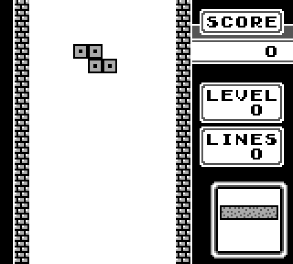
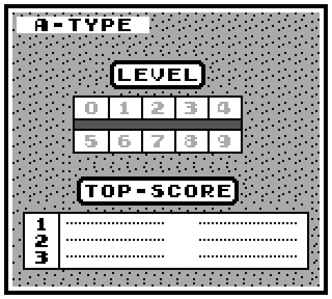
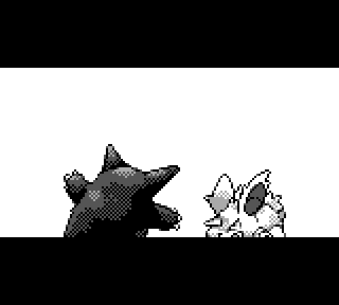

# Game Boy Emulator

A DMG (original Game Boy) emulator written in C++ with SDL2. It runs commercial
games at full speed — **Tetris** and **Pokémon Red** are both playable.

<p align="center">
  
  
  
</p>

## Features

- **CPU** — full LR35902 (SM83) core; passes all 501 opcodes of the
  [SingleStepTests](https://github.com/SingleStepTests/sm83) suite.
- **PPU** — background, window, and sprite layers with both tile-addressing modes,
  8×8 / 8×16 sprites, X/Y flip, palettes, BG-over-OBJ priority, the 10-sprites-per-line
  limit, and STAT/LYC interrupts.
- **Timer** — DIV / TIMA / TMA / TAC with the timer interrupt.
- **Interrupts** — VBlank, STAT, Timer, Serial, Joypad, plus HALT.
- **Input** — keyboard-mapped joypad.
- **Cartridges** — ROM-only, MBC1, and MBC3 (ROM/RAM banking).
- **Frame pacing** — locked to the ~59.7 Hz DMG refresh rate.
- **Serial** — output capture (used to run Blargg-style test ROMs).

## Building

Requires a MinGW-w64 g++ toolchain. SDL2 headers/libs are bundled under `src/include`
and `src/lib`, and `SDL2.dll` ships alongside the binary.

```sh
make            # produces load.exe
```

## Running

```sh
./load.exe                                  # defaults to Tetris
./load.exe "path/to/game.gb"                # any ROM-only / MBC1 / MBC3 cart
```

### Controls

| Key         | Button |
| ----------- | ------ |
| Arrow keys  | D-pad  |
| Z           | A      |
| X           | B      |
| Enter       | Start  |
| Right Shift | Select |

## Project structure

```
src/
  main.cpp       SDL window, event loop, frame pacing
  cpu.cpp        registers, flags, full opcode set, interrupts
  memory.cpp     memory bus, MBC banking, cartridge/joypad state
  timer.cpp      DIV / TIMA timer
  ppu.cpp        background / window / sprite rendering
  emulator.hpp   shared globals and prototypes
  include/, lib/ bundled SDL2
tests/
  sst_test.cpp   headless CPU conformance harness (SingleStepTests)
tools/
  cartridge_info.cpp   standalone cartridge-header dumper
docs/screenshots/
```

## Testing

The CPU is validated against SingleStepTests. Build the headless harness and feed it
per-opcode test data:

```sh
make sst_test
```
